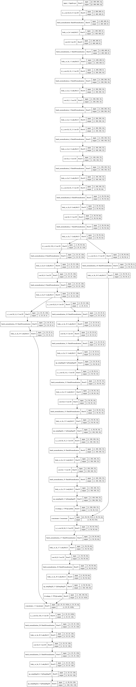

# image-denoising-tf

Image denoising algorithms implemented in tensorflow 2

# Deep Image Prior

The [deep image prior](doi.org/10.1007/s11263-020-01303-4) algorithm is
implemented in tensorflow 2.


Command line usage:
```bash
usage: 
python deepimprior.py ./data/im03.png --outpath ./data/outimages/ --outprefix out_denoised --verbose 1 --epochs 10000 --learning_rate 0.1 --save_model_path ./data/outmodels/model --period 20

Denoise a given image using deep image prior algorithm Beware of the following
issues before proceeding with the usage of this script: - Convolution based
algorithms are sensible to image size. Please use a square image. Ex: 800x800,
or 600x600. - Image size significantly effects the training. Either make sure
you have enough computation power, or adjust the image size appropriately. -
Lastly as with all the gradient based methods we are using a stable learning
rate. Feel free to adjust it before the training phase. I am thinking of
adding decay learning rate option in the future.

.
positional arguments:
  imagepath             path to the image

optional arguments:
  -h, --help            show this help message and exit
  --outpath OUTPATH     path for saving outputs
  --outprefix OUTPREFIX
                        prefix that will e prepended to intermediate files
  --epochs EPOCHS       number of training epochs
  --verbose {0,1}       verbose output during training
  --learning_rate LEARNING_RATE
                        learning rate for the optimizer
  --save_model_path SAVE_MODEL_PATH
                        Save model to path at each period of epochs
  --load_model_path LOAD_MODEL_PATH
                        Load model from path to resume training
  --period PERIOD       Periodic activity number, saving images, models etc at the end of each
                        period/epoch number
```

Several use cases are implemented:

- If you want to reuse the object that encapsulates the options covered in the
  command line usage in another setting just import the `DeepImPriorManager`
  object. Here is how to do it:

```python
from deepimprior import DeepImPriorManager
from PIL import Image

verbose = True
image_path = "./data/my_noisy_image.png"
period = 200  # interval of epochs, used for scheduling callbacks
learning_rate = 0.01  # the value is taken from the paper
epochs = 2400  # the value is taken from the paper
out_folder = "./data/outimages"
out_prefix = "my_denoised_"
save_model_path = "./data/outmodels/model"  # save model here at the end of a period

# if you want to resum training
load_model_path: Optional[str] = "./data/outmodels/model_1000"

# in verbose output you can save the model plot and its summary to a file
plot_path = "plot_model.png",
summary_path = "model_summary.txt",

deep_prior = DeepImPriorManager(
    noisy_image = Image.open(image_path),
    verbose = verbose,
    period = period,
    learning_rate = learning_rate,
    epochs = epochs,
    out_folder = out_folder,
    out_prefix = out_prefix,
    save_model_path = save_model_path,
    load_model_path = load_model_path,
    plot_path = plot_path,
    summary_path = summary_path)

# fits the model and saves it to "out_folder/outp_prefix-result.png"
deep_prior.run_save()

# or you can just fit the model and do something else with it like
# evaluation etc.
deep_prior.run()
model = deep_prior.model

# do other stuff with the model
```

If you want rebuild the architecture used in the paper, the `u_i`, `d_i` and
`s_i` functions implement the components of the architecture implied in the
figure 21 from page 19. They output a list of layers. No input shape is given
during their creation. We diverge from the paper in padding. The paper uses
reflect padding. Since the keras api does not implement reflect padding, we
use the "same" padding option instead.

For evaluation of list of layers that result from the above mentioned
functions, we had written `apply_layers` function. The function is very
simple:

```python
def apply_layers(inlayer, lst: List[tf.keras.layers.Layer]):
    """!
    \brief apply layers consecutively
    \param inlayer input either a result of a previous evaluation or
    tf.keras.layers.Input. Notice that it is not tf.keras.layers.InputLayer
    """
    x = inlayer
    for layer in lst:
        x = layer(x)
    return x
```

Here is the plot of the model:

